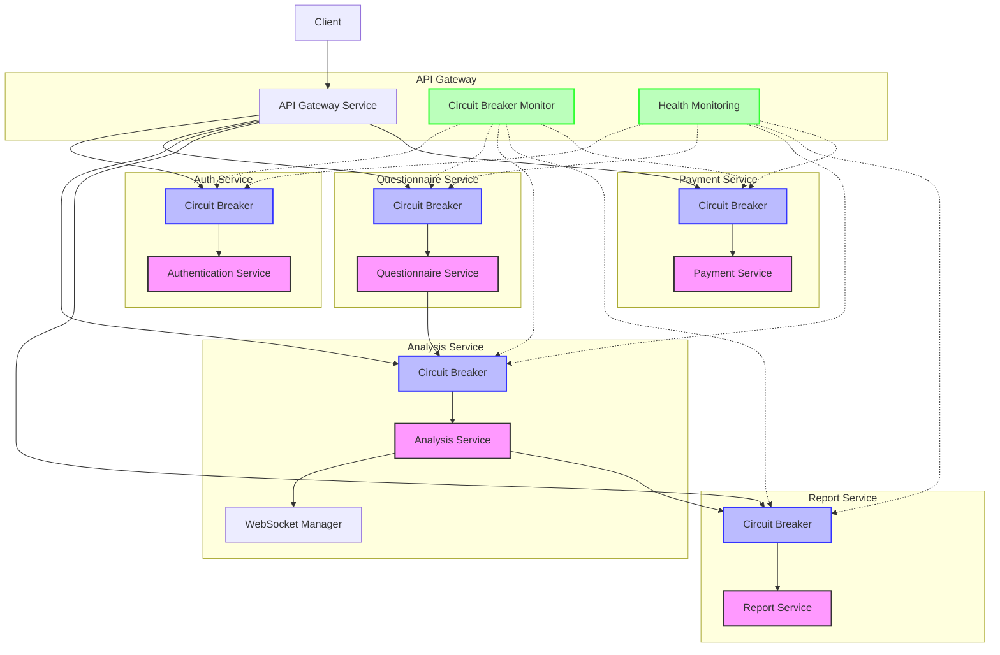
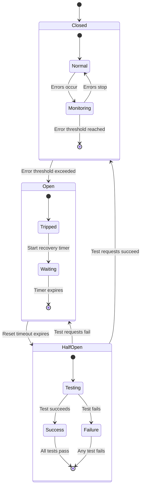
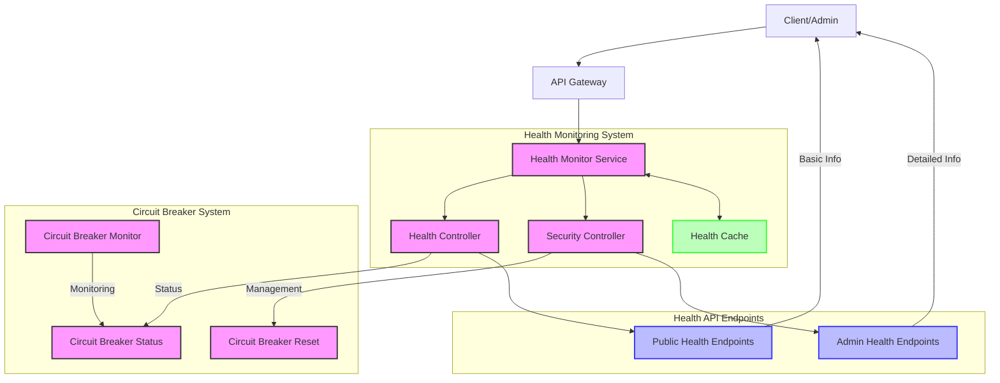
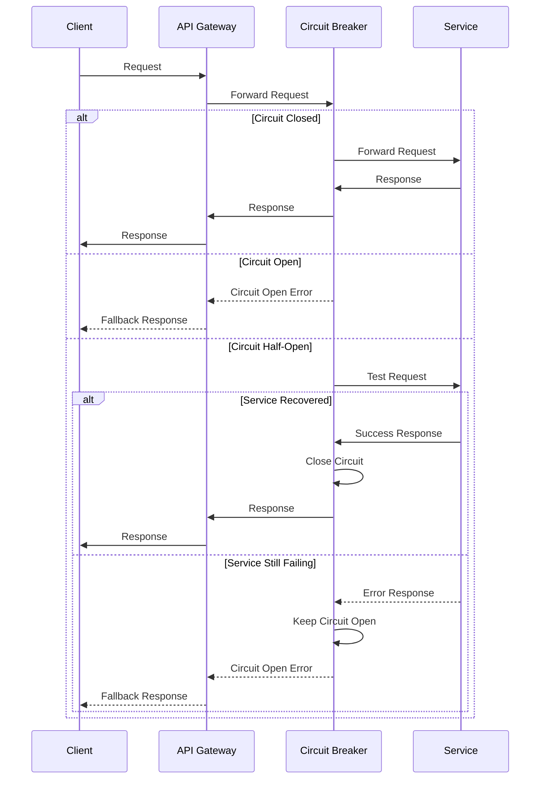
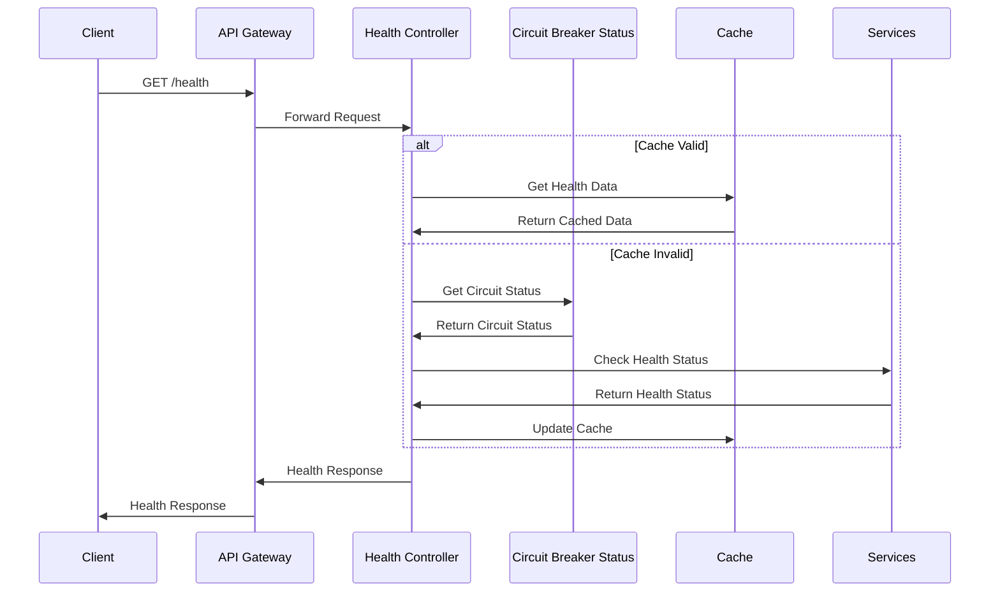

# Circuit Breaker Implementation Visualization

This document provides visual representations of the circuit breaker pattern implementation across the Risk Assessment Application microservices.

## Architecture Overview

The following diagram illustrates how the circuit breaker pattern is integrated into the microservice architecture:

## Circuit Breaker States

The circuit breaker pattern operates in three states:

## Service Health Monitoring Integration

The following diagram shows how the health monitoring system integrates with circuit breakers:

## Circuit Breaker Request Flow

The following sequence diagram illustrates the flow of a request through the circuit breaker:

## Health Check Data Flow

The following sequence diagram shows the flow of health check data:

These visualizations provide a clear understanding of how the circuit breaker pattern is implemented and integrated across the Risk Assessment Application.
